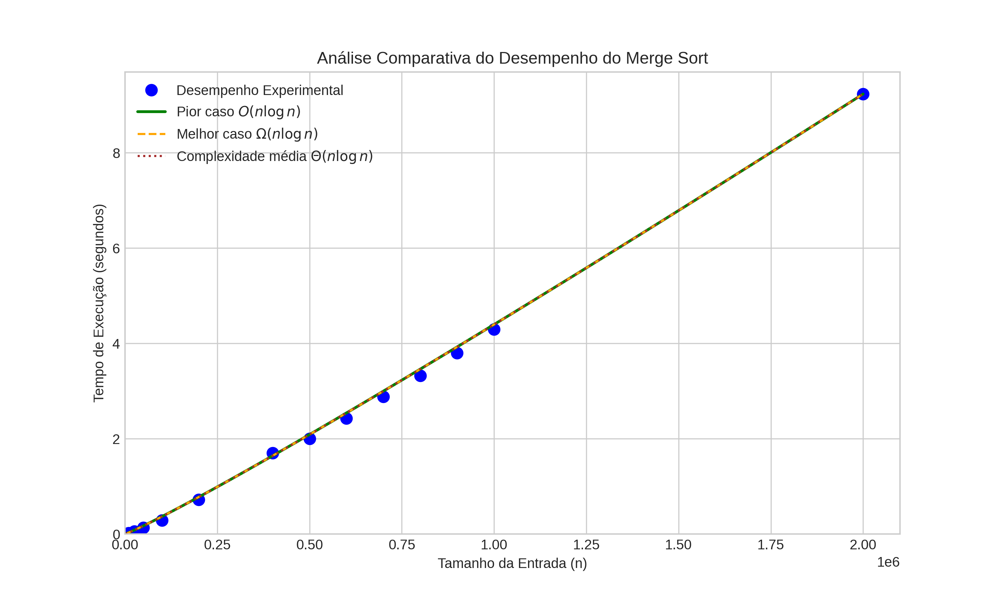

# Análise de Desempenho do Algoritmo Merge Sort



---

##  Apresentação

Este projeto foi desenvolvido para a disciplina de **Projeto e Análise de Algoritmos**, do curso de **Ciência da Computação** da **Universidade Federal de Alagoas (UFAL)**, ministrada pelo professor **Alexandre Paes**. O objetivo é aplicar os conhecimentos teóricos sobre complexidade de algoritmos em uma análise experimental prática.

## Equipe

*   Ana Beatriz da Silva
*   Deivisson da Silva Rocha
*   Rayane Quézia Lima Duarte
*   Thallys Asafe Ribeiro de Alcantara

## Descrição do Projeto

O projeto consiste em uma análise empírica do desempenho do algoritmo de ordenação **Merge Sort**. Um script em Python foi implementado para:

1.  Executar o Merge Sort em conjuntos de dados de tamanhos variados.
2.  Medir o tempo de execução para cada tamanho de entrada.
3.  Gerar gráficos que comparam o desempenho experimental com as curvas de complexidade teóricas (Big O, Big Omega e Big Theta).

O objetivo é observar, na prática, como o tempo de execução do algoritmo se alinha com sua complexidade teórica esperada de **O(n log n)**.

## Tecnologias Utilizadas

*   **Python 3**
*   **Matplotlib**: Para a geração dos gráficos.
*   **NumPy**: Para manipulação eficiente de arrays e cálculos numéricos.

## Resultados Esperados

Ao executar o script, você observará:

1.  **Tabela de Desempenho no Terminal**: Uma tabela será impressa no console, mostrando o tempo de execução para cada tamanho de entrada `n`.

    ```
    | Tamanho da Entrada (n) | Tempo de Execução (s) |
    | :--------------------- | :-------------------- |
    | 1000                   | 0.004123              |
    | 5000                   | 0.023456              |
    | ...                    | ...                   |
    ```

2.  **Geração de Gráficos**: Dois arquivos de imagem serão salvos no diretório do projeto:

    *   `grafico_experimental_simples.png`: Mostra apenas a curva de desempenho experimental.
    *   `grafico_artigo_final.png`: Um gráfico mais completo que compara os dados experimentais com as curvas teóricas de complexidade **O(n log n)**, **Ω(n log n)** e **Θ(n log n)**, demonstrando visualmente a eficiência do algoritmo.

## Análise dos Resultados

O gráfico final (`grafico_artigo_final.png`) é a principal saída deste projeto. Ele plota o tempo de execução medido em função do tamanho da entrada e sobrepõe as curvas teóricas de complexidade. A análise visual permite confirmar que o comportamento prático do Merge Sort se ajusta muito bem à curva **O(n log n)**, validando a teoria de análise de algoritmos.
